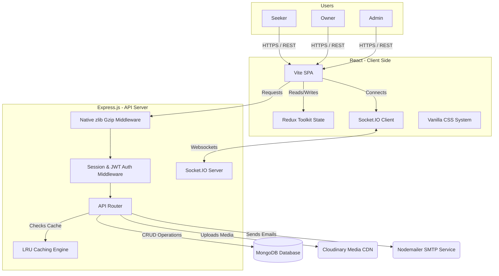

# <p align="center"><br>🏛️ RoomBridge</p>

<p align="center">
  
  
  
  
  
</p>

<p align="center">
  <b>RoomBridge is Pakistan's premier full-stack room rental and roommate matching platform designed to create safe, curated, and highly integrated sanctuaries for students and young professionals.</b>
</p>

---

> [!IMPORTANT]
> RoomBridge replaces unsafe classified advertisements with **100% physically verified listings**, **lifestyle-compatible roommate matching**, and **secure direct owner-to-tenant communication channels**.

---

## 📖 Table of Contents
- [✨ Key Product Offerings](#-key-product-offerings)
- [🏗️ System Architecture & Workflow](#️-system-architecture--workflow)
- [🛠️ Detailed Tech Stack](#️-detailed-tech-stack)
- [📦 Directory Structure](#-directory-structure)
- [🚀 Local Development Setup](#-local-development-setup)
- [🔧 Seed & Maintenance Utilities](#-seed--maintenance-utilities)
- [✅ Verification & Testing](#-verification--testing)
- [☁️ Production Deployment Checklist](#️-production-deployment-checklist)
- [📜 License](#-license)

---

## ✨ Key Product Offerings

RoomBridge delivers a unified workspace targeting all key stakeholders in the housing ecosystem:

### 🔍 Seeker Experience
*   **Interactive Listing Finder:** Filter properties based on city, budget range, room type (Single, Shared, Apartment), and amenities.
*   **Smart Roommate Matching:** Fill in detailed lifestyle preferences (smoking habits, study hours, noise tolerance, etc.) and let our roommate matching algorithm compute compatibility indices with other seekers.
*   **Real-Time Communication:** Talk directly with property owners and potential roommates through integrated Socket.IO private chats.
*   **Secure Booking Request Lifecycle:** Send reservation requests, track their approval status, and manage active booking receipts.

### 🏢 Owner Experience
*   **Hostel & Listing Builder:** Author listings with multi-image Cloudinary upload, location details, rent configurations, and amenities checklist.
*   **Booking Hub:** Accept, reject, or cancel seeker booking proposals in a centralized booking management interface.
*   **Dashboard Analytics:** Track listing views, total booking submissions, active listings, and revenue metrics in real-time.

### 🛡️ Admin Moderation Center
*   **System-Wide Auditing:** Review reported users or listings flagged by community members.
*   **Global User & Listing Control:** Approve listings, ban malicious accounts, delete inappropriate properties, and send push notifications.
*   **Unified Messaging:** Moderate general inquiries and contact messages.

---

## 🏗️ System Architecture & Workflow

Here is how the core workflows of RoomBridge are connected:



---

## 🛠️ Detailed Tech Stack

RoomBridge is built using a secure, performant, and dependency-conscious modern JavaScript stack:

### 🌐 Frontend (roombridge-frontend)

| Category | Technologies | Purpose |
| :--- | :--- | :--- |
| **Framework** | React (Vite SPA) | Fast, modular component structure and hot reloading. |
| **State** | Redux Toolkit & React Redux | Centralized, predictable store for authorization, session caches, and user profiles. |
| **Styling** | Vanilla CSS Variables + Tailwind | A curated, Figma-aligned color palette (Dark Green `#012D1D`, Peach `#FFA26B`). |
| **Networking** | Axios + Socket.IO Client | Cookie-based session delivery, interceptors, and real-time private messages. |
| **Utilities** | React Dropzone & Hot Toast | Drag-and-drop file imports and notification toast banners. |

### ⚙️ Backend (roombridge-backend)

| Category | Technologies | Purpose |
| :--- | :--- | :--- |
| **Runtime** | Node.js & Express.js | Scalable asynchronous routing and request lifecycle. |
| **Database** | MongoDB & Mongoose | Flexible NoSQL document models and automatic indexes. |
| **Real-time** | Socket.IO Server | Duplex communication sockets for immediate message broadcasts. |
| **Caching** | Native LRU Cache | In-memory 30-second TTL caches for admin metrics and landing searches. |
| **Compression**| Custom `zlib` Middleware | Native GZIP compression without external dependencies. |
| **Security** | Helmet, Sanitizers & Rate Limiters | Prevention of XSS, NoSQL injections, and authentication abuse. |

---

## 📦 Directory Structure

```
RoomBridge/
├── roombridge-frontend/         # Vite + React Client
│   ├── src/
│   │   ├── assets/              # Static media, icons, and illustrations
│   │   ├── components/
│   │   │   ├── chat/            # Real-time chat system components
│   │   │   ├── common/          # Reusable components (Navbar, Logo, Toast, Modal, Loader)
│   │   │   ├── dashboard/       # Role-specific layouts
│   │   │   └── listings/        # Listing cards and search filters
│   │   ├── context/             # SocketContext providers
│   │   ├── pages/
│   │   │   ├── admin/           # Admin panel and listing moderators
│   │   │   ├── auth/            # Sign In, Sign Up, OTP/Email Verification pages
│   │   │   ├── owner/           # Listing builder and booking handlers
│   │   │   ├── public/          # Landing Page, Listings Page, Details, About, Contact, Terms
│   │   │   └── seeker/          # Seeker dashboard and roommate matching
│   │   ├── redux/               # Global authentication slices
│   │   ├── services/            # API call modules (Axios base instance)
│   │   └── App.jsx              # Main routing component
│   └── tailwind.config.js       # Core theme variables
│
└── roombridge-backend/          # Node.js + Express API Server
    ├── scripts/                 # Demo data seeding and maintenance tasks
    ├── src/
    │   ├── controllers/         # Business logic and query logic
    │   ├── middleware/          # Security rate limiters, auth hooks, upload filters
    │   ├── models/              # MongoDB Schemas (User, Listing, Booking, Message)
    │   ├── routes/              # Express API Route Declarations
    │   ├── utils/               # Native GZIP filters, mailers, caches, responses
    │   └── app.js               # Application middleware initialization
    └── server.js                # App entry point & Websocket server
```

---

## 🚀 Local Development Setup

Follow these steps to run RoomBridge on your local computer:

### 1️⃣ Prerequisites
*   **Node.js:** version 18.0.0 or higher.
*   **MongoDB:** A running local MongoDB instance or a remote MongoDB Atlas connection URI.
*   **Cloudinary Account:** For uploading hostel photographs.

### 2️⃣ Environment Variables Config
Create the environment configuration files in both backend and frontend directories:

#### Backend Config (`roombridge-backend/.env`)
```env
PORT=5000
MONGO_URI=mongodb://127.0.0.1:27017/roombridge
JWT_SECRET=your_jwt_signing_key_secret_string
JWT_EXPIRE=7d
CLOUDINARY_CLOUD_NAME=your_cloudinary_cloud_name
CLOUDINARY_API_KEY=your_cloudinary_api_key
CLOUDINARY_API_SECRET=your_cloudinary_api_secret
CLIENT_URL=http://localhost:5173
NODE_ENV=development

# SMTP Email Configuration (Nodemailer)
SMTP_HOST=smtp.mailtrap.io
SMTP_PORT=2525
SMTP_USER=your_smtp_username
SMTP_PASS=your_smtp_password
FROM_EMAIL=noreply@roombridge.pk
FROM_NAME=RoomBridge Support
```

#### Frontend Config (`roombridge-frontend/.env`)
```env
VITE_API_URL=http://localhost:5000
VITE_APP_NAME=RoomBridge
```

### 3️⃣ Run Servers
Open two terminal windows side-by-side to start the developer environments:

#### Startup Backend Node Server
```bash
cd roombridge-backend
npm install
npm run dev
```
*The server will run on [http://localhost:5000](http://localhost:5000).*

#### Startup Frontend Vite Client
```bash
cd roombridge-frontend
npm install
npm run dev
```
*The client application will serve on [http://localhost:5173](http://localhost:5173).*

---

## 🔧 Seed & Maintenance Utilities

RoomBridge is equipped with database scripts to pre-populate mock data for quick verification. Navigate to the `roombridge-backend` directory to run:

*   **Seed Admin Account:** Create a default system administrator login.
    ```bash
    npm run seed:admin
    ```
    > [!TIP]
    > **Default Admin Credentials:**  
    > - **Email:** `admin@roombridge.pk`  
    > - **Password:** `AdminSecure123!`

*   **Seed Complete Mock Data:** Populates multiple Seekers, Owners, Listings, Bookings, and roommate preferences.
    ```bash
    npm run seed:demo
    ```

*   **Clean database:** Wipes all seeded mock data.
    ```bash
    npm run cleanup:demo
    ```

---

## ✅ Verification & Testing

Verify that your local changes run cleanly by invoking the quality assurance suites:

```bash
# Lint the backend application
cd roombridge-backend
npm run lint

# Lint and compile the frontend distribution bundle
cd ../roombridge-frontend
npm run lint
npm run build
```

---

## ☁️ Production Deployment Checklist

### Backend Application
1.  Configure `NODE_ENV=production` to enable secure cookies, disable developer debug errors, and restrict CORS limits.
2.  Enable server compression automatically (native `zlib` middleware is active by default).
3.  Set up production-grade SMTP access inside environment keys.
4.  Launch using a process manager such as PM2: `pm2 start server.js --name "roombridge-api"`.

### Frontend Application
1.  Validate that `VITE_API_URL` points to the public backend domain.
2.  Run `npm run build` to generate compiled static assets inside the `/dist` output folder.
3.  Upload the contents of `/dist` to static host providers (such as Vercel, Netlify, or AWS S3).
4.  Configure route rewrites (e.g. `_redirects` or configurations) to redirect all subpaths to `index.html` for React Router to function properly.

---

## 📜 License
This codebase is distributed under the MIT License. See `LICENSE` for details.

---
*Verified with updated global Git user configuration.*