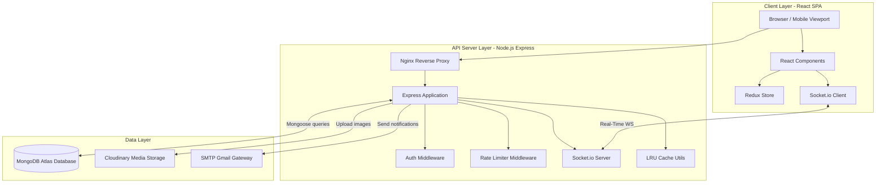
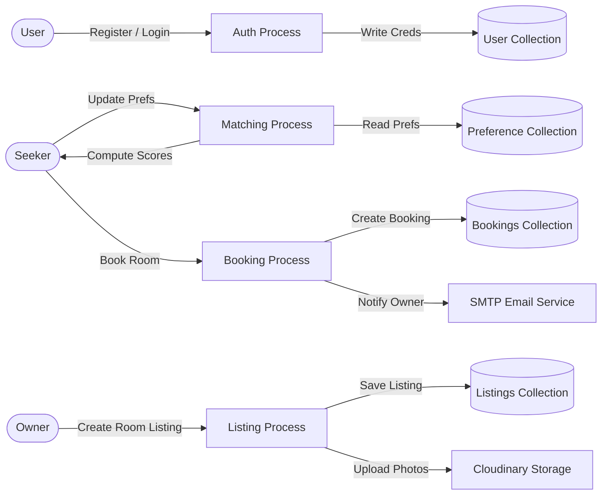
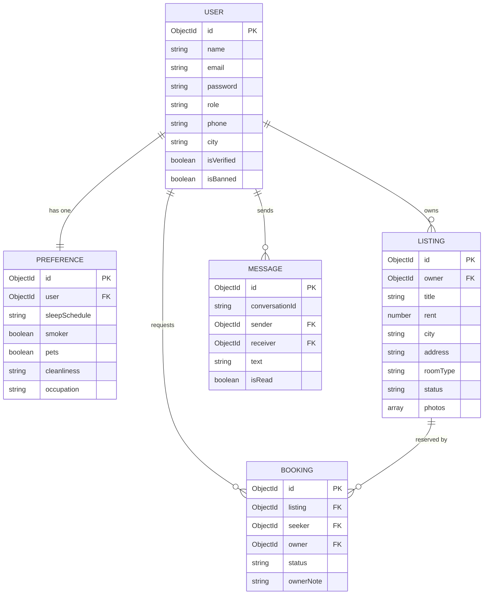
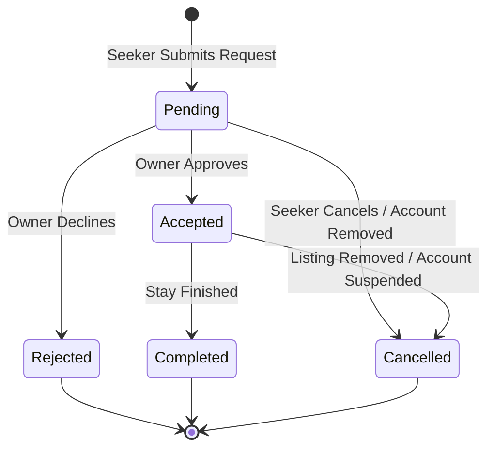

# Software Requirements Specification (SRS)
## Project: RoomBridge — Pakistan's #1 Room Rental & Roommate Matching Platform
### Document Version: 1.0.0
### Date: July 5, 2026

---

## 1. Introduction

### 1.1 Purpose
This document specifies the software requirements for the **RoomBridge** platform. It provides a complete description of the system's functions, user roles, interfaces, performance parameters, and architectural details. It is intended for developers, project managers, QA engineers, and system administrators.

### 1.2 Scope
RoomBridge is a web-based portal designed to simplify the process of finding rooms and compatible roommates in Pakistan. The platform bridges the gap between seekers (tenants/hostelites) and owners (landlords/hostel managers). 

Key modules include:
*   **Authentication & Role Management**: Multi-role support (Seeker, Owner, Admin) with secure cookie-based JWT sessions.
*   **Listing Management**: Photo uploading via Cloudinary, amenity selection, pricing, and geo-data mapping.
*   **Smart Roommate Matching**: Compatibility scoring based on lifestyle preferences (sleep schedule, smoking, pets, cleanliness).
*   **Real-time Messaging**: Socket.io-based chat for secure peer-to-peer communication.
*   **Booking System**: Request and reservation flows to secure accommodations.
*   **Admin Dashboard**: User management, listing verification, email broadcasts, and content moderation.

### 1.3 Definitions, Acronyms, and Abbreviations
*   **SRS**: Software Requirements Specification
*   **JWT**: JSON Web Token
*   **SMTP**: Simple Mail Transfer Protocol
*   **DFD**: Data Flow Diagram
*   **ERD**: Entity Relationship Diagram
*   **TTL**: Time To Live (caching parameter)
*   **LRU**: Least Recently Used (cache eviction policy)

---

## 2. Overall Description

### 2.1 Product Perspective
RoomBridge is an independent, three-tier application consisting of:
1.  **Frontend (Client Layer)**: React SPA built with Vite, styled with CSS/Tailwind, and managed via Redux Toolkit.
2.  **Backend (API Server Layer)**: Node.js Express server handling API requests, security middleware, and real-time Socket.io events.
3.  **Database (Data Layer)**: MongoDB Atlas cluster storing user profiles, listings, bookings, preferences, and chats.

### 2.2 User Classes and Characteristics
*   **Seeker**: Individual looking for shared or single rooms. Can browse listings, chat, fill roommate compatibility preferences, and request bookings.
*   **Owner**: Property owner or hostel manager. Can post listings, manage reservations, and communicate with seekers.
*   **Admin**: System moderator. Manages listing verification, suspends users, and sends system-wide announcements.

### 2.3 Operating Environment
*   **Client**: Modern web browsers (Chrome, Edge, Safari, Firefox) on desktop and mobile viewports.
*   **Server**: Node.js v18+ running on Linux/Windows hosts (e.g., managed via PM2).
*   **Database**: MongoDB version 6.x or newer.

---

## 3. System Architecture & Diagrams

### 3.1 Three-Tier System Architecture
The following Mermaid diagram outlines the system architecture of the RoomBridge application:

---

### 3.2 Data Flow Diagram (DFD Level 1)
This DFD describes how data moves through the system during primary operations:

---

### 3.3 Database Entity Relationship Diagram (ERD)
The database schema consists of five main collections managed via Mongoose:

---

## 4. Functional Requirements

### 4.1 Module 1: Authentication & Onboarding
*   **Req-1.1 (Register)**: Users must register specifying their role (`seeker` or `owner`).
*   **Req-1.2 (Email Verification)**: A verification token must be generated and emailed via SMTP on registration. Accounts remain unverified until verified.
*   **Req-1.3 (Secure Cookie Sessions)**: Login sets an `httpOnly`, `secure` cookie containing the JWT token.
*   **Req-1.4 (Reset Flow)**: Forgot password flow generates a SHA256 hashed token emailed to the user, allowing reset within a 1-hour expiry.

### 4.2 Module 2: Listing Management
*   **Req-2.1 (Create)**: Owners can create rooms specifying Title, Rent, Address, City, Room Type (Single/Shared), Roommate Preferences, and Amenities.
*   **Req-2.2 (Verification State)**: New listings default to `pending` status. They are visible to seekers only after an admin approves them (`active` status).
*   **Req-2.3 (Photo Management)**: Multi-photo uploads (up to 6 files) are stored in Cloudinary. Deleting a listing purges associated photos from Cloudinary.
*   **Req-2.4 (Cache Invalidation)**: Listings query cache is invalidated upon creation, modification, or deletion of any room.

### 4.3 Module 3: Roommate Matching Algorithm
*   **Req-3.1 (Preference Collection)**: Seekers fill out a compatibility form detailing sleep schedule (early/late), smoking habits, cleanliness tolerance, and occupation.
*   **Req-3.2 (Similarity Computation)**: The system computes compatibility using a weighted match formula:
    $$\text{Compatibility} = (W_s \cdot S_s) + (W_k \cdot S_k) + (W_p \cdot S_p) + (W_c \cdot S_c)$$
    Where sleep schedule ($S_s$) cleanliness ($S_c$), smoking ($S_k$), and pets ($S_p$) are cross-referenced.
*   **Req-3.3 (Capped Retrieval)**: Queries for compatibility fetch a maximum candidate pool of 500 records to maintain high API performance.

### 4.4 Module 4: Real-time Messaging
*   **Req-4.1 (State Management)**: Real-time message exchange utilizes a Socket.io middleware with fallback long-polling.
*   **Req-4.2 (Session Identification)**: Sockets identify user sessions using standard handshake cookie parses.
*   **Req-4.3 (Unread Badge Sync)**: The system maintains an unread count badge in Redux which updates dynamically when messages arrive.

### 4.5 Module 5: Booking & Reservation Flow
The booking lifecycle is defined by the following state machine transitions:

*   **Req-5.1 (Active Bookings Lock)**: A listing must turn `inactive` (un-browsable) once a booking is `accepted`.
*   **Req-5.2 (Cascade Deletion Guard)**: If an owner account is deleted by an admin, all active bookings must be set to `cancelled` with an automated explanatory note, rather than being silently hard-deleted.

---

## 5. Non-Functional Requirements

### 5.1 Security
*   **NFR-1.1 (JWT Configuration)**: Secrets must be at least 32-character high-entropy keys. Access and Refresh secrets must be isolated.
*   **NFR-1.2 (NoSQL Sanitization)**: Express body parser must sanitize all keys beginning with `$` or containing `.` to prevent MongoDB injection attacks.
*   **NFR-1.3 (CORS)**: Cross-Origin Resource Sharing whitelist must restrict requests to authorized frontend domains.

### 5.2 Performance & Reliability
*   **NFR-2.1 (Rate Limiting)**: API routes must employ rate limiters:
    *   Auth routes: Maximum 5 failed attempts per 15 minutes.
    *   Public Listing Views: Maximum 1 view increment per IP per 10 minutes.
    *   General API: Maximum 200 requests per 15 minutes.
*   **NFR-2.2 (LRU Cache Eviction)**: Listings browse cache must feature an automated TTL sweep running every 30 seconds to invalidate stale entries.
*   **NFR-2.3 (DNS Resiliency)**: Database connection must possess an automatic SRV-to-direct connection string fallback to recover from local ISP DNS blockers.
